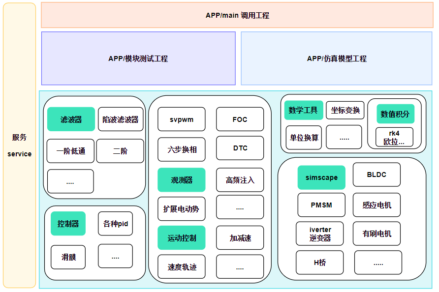
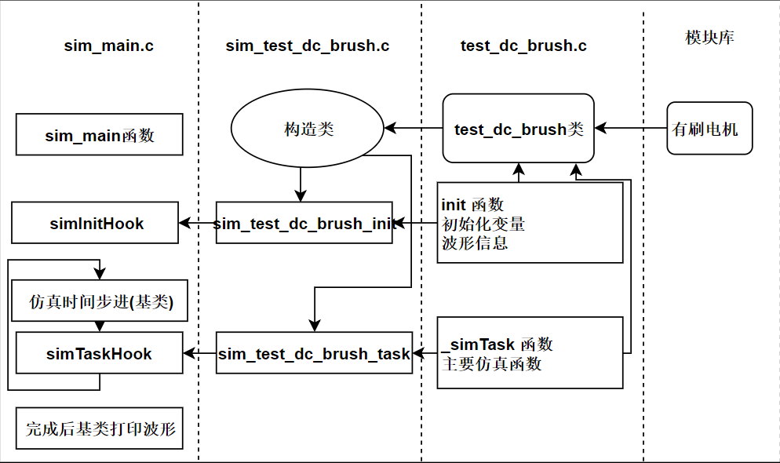
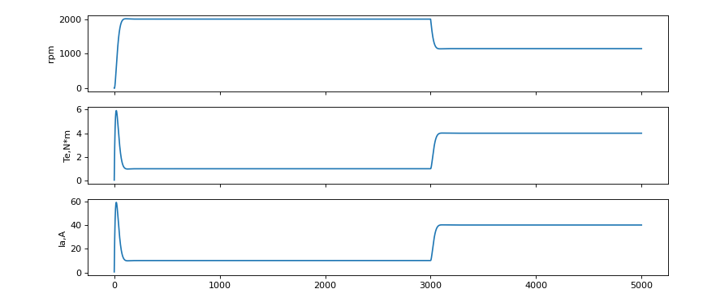

# c语言电机仿真
这是一个面向对象的、模块化的电机控制c语言框架V1。

## 介绍
我为了更好的构建电机控制知识体系，刚好受到陈嘉豪博士的电机仿真c框架，和工作中使用webot的仿真软件启发。采用面向对象的的方式构架了这个软件。 

陈博的github:https://github.com/horychen/ACMSIMC_TUT

对于这个开源项目
1. 希望对电机控制初学者有所帮助
2. 希望对习惯simulink仿真，而不知如何编码的同学有所帮助。

后期可能慢慢的会补一些文档。
- 如果你觉得不错，认同这个开源项目，并且愿意使用,同时十分欢迎贡献：模块库，仿真样例。
- 联系方式：  
    1. **qq群:528884293**  
    2. qq:1084746243   
    3. 微信公众号:wang_chong_wei  

### 框架
- 整个c风格是使用c语言模仿cpp写的，所以需要一点c语言的基础。
- 框架也还在探索中。

  

## 依赖
1. 平台:Windows
2. IDE: QT5  MINGW64bit
3. python: python3.9(64bit) **matplotlib库** 

## 修改
1. python相关
- 需要在.pro中修改python的库的位置
- 需要在 app/sim_config.h 中修改python的库的位置

## 编译
你需要在QT IDE中选择MINGW 64bit 进行编译。
1. python相关
- 第一次编译完后会报错，需要将py文件夹下的wave_plot.py放到目录下:build-motor_simulation-Desktop_Qt_5_12_11_MinGW_64_bit-Debug
- 因为编译后的.exe会调用这个py，然后再次编译。

---
最开始我是想用qt的c++写波形，倔强的我想学习一下python，结果就去学习了c语言如何调用python，导致加入python配置有点麻烦。

如果不出意外，顺利的话。V1版本把差不多的模型仿真建立后。我会根据情况重新写个V2版本，使用c++的qt波形显示，以及其他的界面。因为，波形这块用python占的内存有点大，对于python不太熟悉，生成波形的调节，不太满意。而且这种方式占用内存有点大。

**当然，我还有个设想，有空的话会设计一款小驱动器。直接把仿真的代码放到驱动器上测试使用，当然还有对应的上位机，仿真软件就是上位机的一部分了。**

---

## 示例一个有刷电机的调用   

## 运行后的波形  

## pmsm给Uq电压测试波形  

